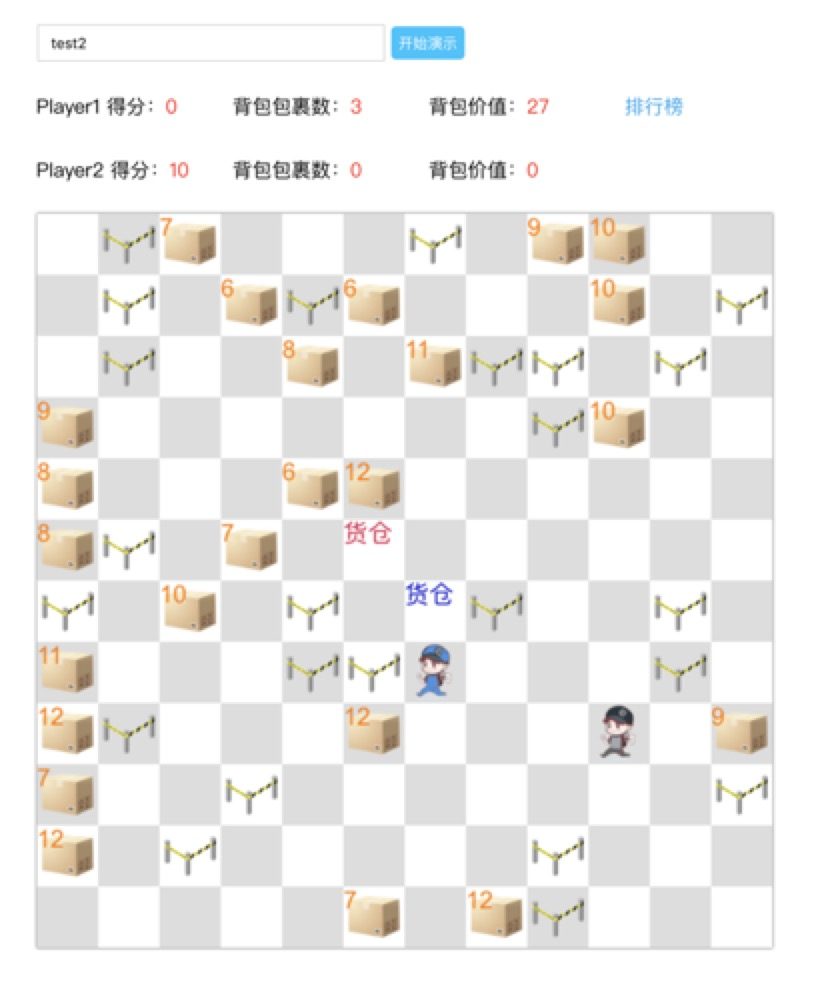

## 顺丰小哥AI挑战赛

### 比赛规则概述

 在去年比赛的基础上引入对抗机制，同时规则出现一些新的变化

    两个参赛者的AI程序控制的小哥将在一个方格世界中进行对抗，比赛谁能够收集到更多包裹分值
    方格世界中会随机生成包裹和障碍物，每个包裹具有随机的分值(6-12)
    AI程序可以控制小哥在地图中上下左右的移动，每个回合能够移动一次
    回合交替进行，player1首先移动，然后是player2，依次交替
    AI小哥遇到包裹则能捡起包裹，但是小哥的背包有容量上限，超过上限则无法拿到更多包裹
    地图中，每个小哥都有一个大本营，小哥只有将包裹拿回大本营才能获得对应的分数奖励
    小哥无法移动到以下位置：地图以外、障碍物、敌方小哥所在位置、敌方大本营；非法的移动会使小哥留在原地
    对于AI程序，每个回合有1.5秒计算时间，超时会默认留在原地
    每当一个包裹被拿起，会有新的包裹刷新在地图上
    比赛开始时，小哥会出生在其大本营
    对抗进行两轮，随机数种子保持固定，第一轮结束后，小哥会交换大本营
    每轮比赛，每个小哥会移动N回合

#### REQUIREMENTS

    docker 
    docker-compose

#### HOW TO USE

    cd 到项目根目录
    docker-compose build
    docker-compose up

#### 创建比赛

    方法：
        POST /competitions

    BODY:
        {
            "name": "test2",
            "player1": "p1",
            "player2": "p2",
            "player1_host": "http://test1",
            "player2_host": "http://test2",
            "seed": 10,
        }

    返回值:
        {
            "msg": "ok",
            "result": {
                "name": "test2"
            },
            "success": true
        }

