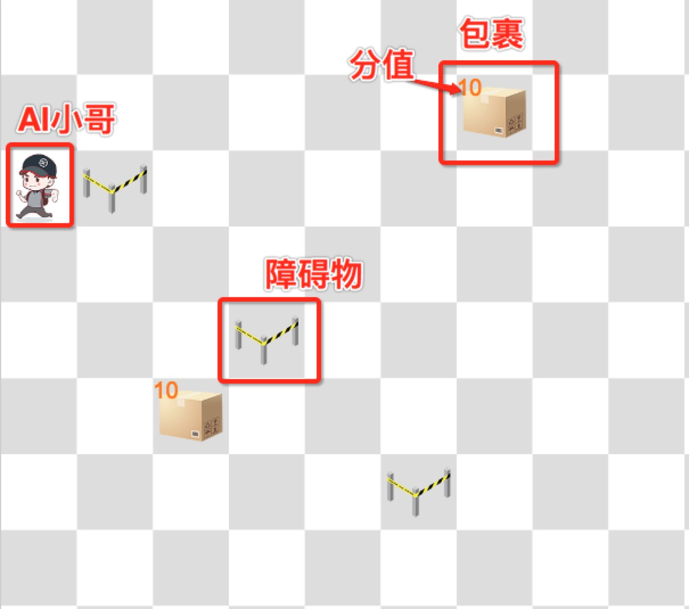

## 顺丰小哥AI挑战赛

### 比赛规则概述

1. 网格世界的大小为12 x 12，大小不会变化
2. 小哥固定出生在最左上角的(0,0)位置
3. 小哥无法移动或者越过障碍物，障碍物的位置始终保持不变
4. 包裹上的数字表示包裹的分值，小哥捡起这个包裹即获得该分数，没被捡起的包裹的价值会随着时间的流失而逐渐衰减（小哥每走一步为一个时间单位，每个时间单位衰减1分)；包裹的价值衰减为0或者被小哥捡起后会消失；地图中会先随机出现一定数目的包裹，每当有包裹消失，会立即随机产生数目相同的包裹
5. AI程序要控制小哥在网格世界中移动288步;可以上下左右移动，每步只能移动一格，不能移动到障碍物上或者网格世界之外；AI程序可以获得当前所有的状态信息，包括所有障碍物的位置、所有包裹的位置和分值、小哥自身的位置
6. 赛事主办方会在比赛的时候提供一套基于HTTP API的仿真环境，方便参赛者开发调试程序，但同时也允许参赛者自己复刻仿真环境；比赛开始后会给出仿真环境的python源码，对仿真环境的细节有任何不明白的地方可以现场咨询主办方
7. 参赛选手需要参加天梯排名以获得最终benchmark决赛的资格；参加天梯排名需要参赛者在提供的天梯环境中进行跑分（取最后10轮跑分的平均分）
8. 最终的benchmark决赛中，每个程序需要进行10轮跑分，10轮跑分中收集到分数最高的程序获胜,
9. 对比赛规则任何有不清楚的地方，都可以咨询主办方

### API DOC

主办方一共提供3套环境: 分别为测试开发环境、天梯环境和最终的benchmark环境
1. 测试开发环境用于开发测试用（也可以在本地自己搭建环境）
2. 比赛环境用于参加天梯排名
3. bechmark环境用于最终决赛的跑分

WARNNING: 为了防止benchmark环境被恶意探测，benchmark环境在决赛时候才公布，而且设计为最多提交10次，所以请谨慎使用

#### 创建环境

    方法：
        POST /test /competition
        （分别对应于开发测试环境，天梯环境。下同。）

    BODY:
        {
            "name": "ooxx" //队名
        }
        开发测试环境中队名可以不填写，天梯环境和benchmark环境中，必须填写

    返回值:
        {
            "msg":"OK", //msg
            "id": "fb061142-0807-44f1-b3fd-b80c9820c973", //环境id
            "state":{ //当前grid world的所有状态
                "ai": {  //小哥所在位置
                    "x": 0,
                    "y": 0
                },
                "walls": [  //所有障碍物位置
                    {
                        "x": 1,
                        "y": 1
                    },
                    ...
                ],
                "jobs": [ //当前所有包裹的位置以及价值
                    {
                        "x": 2,
                        "y": 2,
                        "value": 19
                    },
                    ...
                ]
            }
        }

#### 控制小哥

    方法：
        POST /test/<env_id>/move /competition/<env_id>/move
        env_id需填充

    BODY:
        {
            "direction": "U",
        }
        可选值： U,D,L,R 分别对应上下左右

    返回值：
        {
            "msg":"OK", //msg
            "id":_id, //环境Id
            "state": {...}, //state定义同上，执行完动作之后 grid world的最新状态
            "reward":10, //当前这步获得的价值
            "done":false //是否仿真结束
        }

#### 获取replay

主办方同时还提供一个可视化环境，用于查看relay，url会在现场时公布

    方法:
        GET test/replays/<env_id> competition/replays/<env_id>
        env_id需填充

    BODY:
        无

    返回值:
        {
            "msg":"OK", //msg
            "replay": [state0,state1,...] //历史state值，state定义同上
        }
